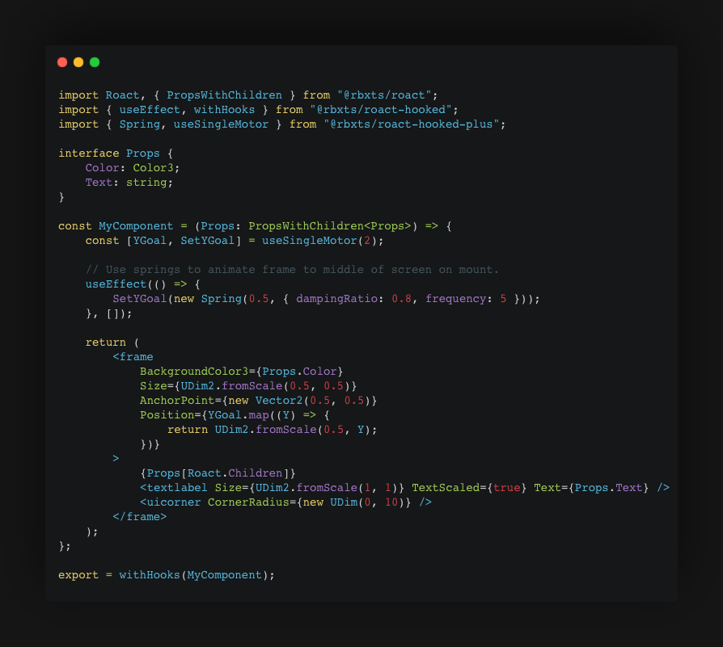

## Table of Contents
- [Table of Contents](#table-of-contents)
- [Chapter 1: Typescript - What and why?](#chapter-1-typescript---what-and-why)
  - [What?](#what)
  - [Why?](#why)
  - [Q\&A](#qa)
- [Chapter 2: Setup](#chapter-2-setup)
  - [Prerequisites](#prerequisites)
  - [Getting Started](#getting-started)
  - [Helpful Tools](#helpful-tools)
- [Chapter 3: Examples](#chapter-3-examples)
  - [Killbrick](#killbrick)
  - [Roact TSX](#roact-tsx)
- [Chapter 4: Conclusion \& Resources](#chapter-4-conclusion--resources)


## Chapter 1: Typescript - What and why?

### What?
Typescript (originally) is a superset of the javascript programming language. It's purpose is to provide static typings to js, allowing developers to be more confident in the code that they write.

Roblox-ts is a ported version of typescript for use on Roblox. It retains many of the beloved features of the original, and is preferred by many developers on the platform.

### Why?
The static type safety provided by typescript amounts to more work upfront in exchange for FAR less unpredictable errors at runtime. Developers also benefit from improved auto-complete throughout their codebase.

### Q&A

**Q:** I've never used typescript before, how can I learn?

**A:** If you are new to typescript, here is a [crash course](https://learnxinyminutes.com/docs/typescript/).

**Q:** What about my luau modules? (ProfileService, Octree, etc.)

**A:** Roblox-ts allows developers to create [definition files](https://roblox-ts.com/docs/guides/using-existing-luau) that provide type definitions to existing luau code. Most modules that you are used to using can be found on npm. 

**Q:** *Wait, luau support types. Why would i choose typescript?*

**A:** While luau does support partial static typing, it is a gradually typed language. This basically means that static typings can be half-baked into a codebase and left to error at runtime. 

Put bluntly, Luau allows us to be lazy with our type annotations. See the following example:

*Keep in mind that the return type will be inferred in these cases, but I'm including it here for clarity.*

```lua
-- Proper Type Annotations
function Append(Str1: string, Str2: string): string
    return Str1 .. Str2
end

Append(1, "Hello") -- If in strict mode, this will throw a type error.

-- No Type Annotations
function AddOne(Number) 
    return Number + 1
end

AddOne("Hello!") -- No issues until you run the game.
```

Typescript on the other hand will not even allow us to compile if there is a single type error within our codebase.

Here is the append method written in typescript:

```ts
function Append(Str1: string, Str2: string): string {
    return Str1 + Str2;
}

// TS will refuse to compile, because this method should never take anything other than a string.
Append(1, "Hello");
```

*New to typescript? Check out this* [typescript crash course](https://learnxinyminutes.com/docs/typescript/).

## Chapter 2: Setup

### Prerequisites

1. External Editor
    - This tutorial assumes you are using vscode, but another editor will work.
2. [Node.js 14+](https://nodejs.org/en/) Installed
3. [Rojo](https://rojo.space/docs/v7/getting-started/installation/) plugin or *preferably* [Rojo CLI](https://rojo.space/docs/v7/getting-started/installation/) 

### Getting Started

1. Create a folder at your destination of choice. 
2. Open this folder with VS-Code.
3. Open your integrated terminal with `Ctrl+Shift+tilde(~)`
4. Type `npm install -g roblox-ts` within your terminal, then `Enter`.
5. Type `rbxtsc init game`, then `Enter`.
   1. Go ahead and hit enter for each item in the interactive setup. 

You should now see some new folders appear.

Awesome! You've setup your first project. If you have used rojo before, you will be familiar with the layout within the `src` folder. You will also notice a `out` folder that mirrors the layout of `src`. This folder is the output of the typescript transpiler, and contains luau code.


### Helpful Tools

Let's add some packages to improve the developer experience. Follow these steps:

1. Open your integrated terminal.
2. Type `npm i` then `Enter` to install any required packages.
3. Type `npm i -g concurrently` then `Enter`. (Install the package)
   1. This will install a tool to your global registry that allows us to run two shell commands at the same time. This will be useful later.
4. Install `npm i @rbxts/services`
   1. This installs a module within our project that automatically imports roblox services. Super handy!

**Woo!** We now have our basic packages installed! Let's continue:

1. Open the `package.json` in the root of your project.
2. Locate the `scripts: []` field.
3. Copy and paste this inside the scripts array: `"dev": "concurrently \"rbxtsc -w\" \"rojo serve\""`
4. Save the file and close it.

We have just created a new command that runs the typescript compiler (`rbxtsc -w`) in watch mode, and `rojo serve` at the same time.

Let's give our new command a try. Go ahead and run `npm run dev` within your terminal. If all is working well, you should see the following:

```sh
roblox-ts/FPS Framework > npm run dev

> flamework-template@1.0.0 dev
> concurrently "rbxtsc -w" "rojo serve"

[1] Rojo server listening:
[1]   Address: localhost
[1]   Port:    34872
[1] 
[1] Visit http://localhost:34872/ in your browser for more information.
[0] [11:27:00 AM] Starting compilation in watch mode...
[0] 
[0] [11:27:01 AM] Found 0 errors. Watching for file changes.
[0] 
```

If you see this, then you are ready to get started! Your typescript code will be automagically converted to luau on save, and those changes will sync into studio via rojo.

*You will need to run this command once whenever you begin work on your project.*

Finally, go ahead and connect to rojo using the studio plugin.

## Chapter 3: Examples

Here are some examples!

### Killbrick
Let's do an example! Let's make a basic killbrick.

( This example is showcased on the roblox-ts homepage. I use it here because it's a great example of the safety provided by roblox-ts :] )

First, connect rojo to your project. If you are using vscode, use `Ctrl/Cmd+Shift+P` to open the command palette. Type Rojo, and click the `Open Menu` option. Then, click the item with a play icon at the bottom.

Head over to `src/server` and create a new file titled `index.server.ts`. This will compile to a server script in game.

1. Begin to type `CollectionService` on line 2.
   - You should see a auto-completion for CollectionService. Hit enter.

You should now see the following line appear at the top of the file.
```ts
import { CollectionService } from "@rbxts/services";
```

This is an example of roblox-ts auto imports!

Let's now loop through each instance with the `Lava` tag, and check if it's a base part.
```ts
for (const obj of CollectionService.GetTagged("Lava")) {
    if (obj.IsA("BasePart")) {

    }
}
```

Great! Now this is where type script really shines. Lets write out some kill logic:

```ts
//...
if (obj.IsA("BasePart")) {
    obj.Touched.Connect(part =>
        part.Parent?.FindFirstChildOfClass("Humanoid")?.TakeDamage(100)
    );
}
```

Now check out what this code compiles to:

```lua
--...
if obj:IsA("BasePart") then
    obj.Touched:Connect(function(part)
        local _result = part.Parent
        if _result ~= nil then
            _result = _result:FindFirstChildOfClass("Humanoid")
            if _result ~= nil then
                _result = _result:TakeDamage(100)
            end
        end
        return _result
    end)
end
```

With our use of `?` between methods, we are telling the compiler that we aren't entirely sure that this object will be present when this code is ran. The compiler automatically wraps our code in nil-checks to ensure that it never errors. Brilliant!

Here is the completed snippet:

```ts
import { CollectionService } from "@rbxts/services";

for (const obj of CollectionService.GetTagged("Lava")) {
    if (obj.IsA("BasePart")) {
        obj.Touched.Connect(part =>
            part.Parent?.FindFirstChildOfClass("Humanoid")?.TakeDamage(100)
        );
    }
}
```

Now, let's tag a part with the `"Lava"` tag and play-test. If you touch this part, your character dies!

### Roact TSX  
One of my favorite features of roblox-ts is roact TSX. This allows you to create TSX files that convert to vanilla roact.

If you have used react before, you'll feel right at home with [roact-hooked.](https://www.npmjs.com/package/@rbxts/roact-hooked)

Here is an example of a roact tsx component using hooks:


More info coming soon!

## Chapter 4: Conclusion & Resources

Thanks for reading! I will be updating this page with more information as i see fit. If you find any typos or incorrect information, please open an issue or DM me!

I plan to create a blog for these types of tutorials, so stay tuned.

Here are some helpful resources Resources:

- Roblox TS Packages: https://www.npmjs.com/search?q=%40rbxts
- Roblox-TS Playground: https://roblox-ts.com/playground
- Docs: https://roblox-ts.com/docs/